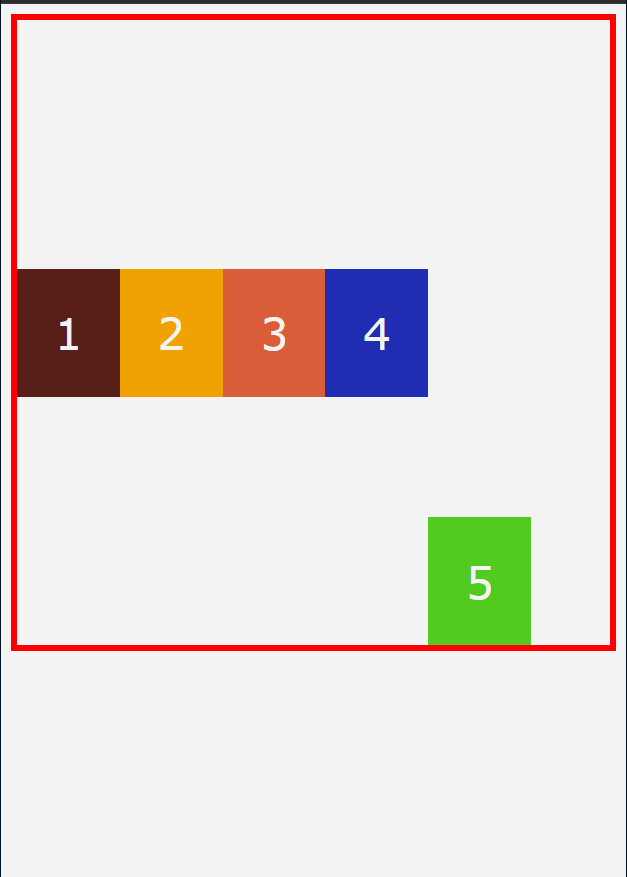
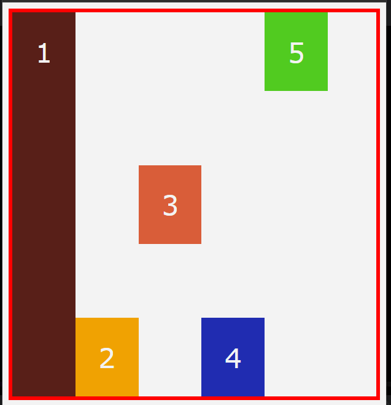
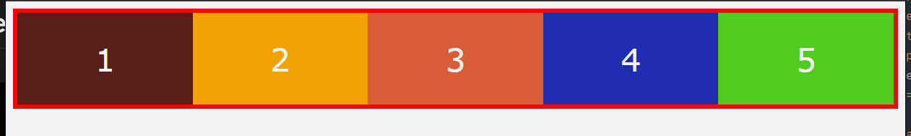
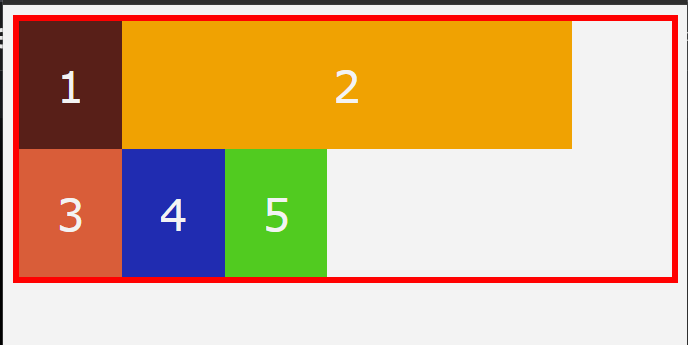

# html content
```html
<div class="container">
    <!--children = flex-items -->
    <div class="box box-1">1</div>
    <div class="box box-2">2</div>
    <div class="box box-3">3</div>
    <div class="box box-4">4</div>
    <div class="box box-5">5</div>
</div>
```
justify-content is for horizontal alignment
align-items is for vertical alignment

```css
.container{
    border: 5px solid red;
    flex-direction: column;
}
.box-1{
    background: #581f18;
    order: 2
}
.box-2{
    background: #f0a202;
}
.box-3{
    background: #d95d39;
}
.box-4{
    background: #202cb1;
}
.box-5{
    background: #51cb20;
    order: -1;
}
```

`order === all children have order:0 by default`
```css
.box-2{
    background: #f0a202;
    order:1
}
.box-5{
    background: #51cb20;
    order: -1;
}
```

## align self
```css
.container{
    display: flex;
    height: 500px;
    align-items: center;
}
.box-5{
    align-self: flex-end;
}
```
results


```css
.container{
    display: flex;
    height: 500px;
    align-items: flex-end;
}
.box-1{
    align-self: stretch;
}
.box-3{
    align-self: center;
}
.box-5{
    align-self: flex-start;
}
```


## flex-grow
```html
<!-- flex-grow all children have flex-grow:0 -->
```
```css
.container{
    display: flex;
}
.box{
    flex-grow: 1;
}
```


```css
.container{
    display: flex;
}
.box-1{
    flex-grow: 1;
}
```

## flex-shrink
```html
<!-- flex-shrink all children have flex-shrink:1 -->
```
flex-shrink est utilisé lorsque le flex-item a une longueur specific
pour maintenir cette longueur, on utilise flex-shrink

```css
.container{
    display: flex;
    flex-wrap : wrap;
}
.box-2{
    width: 300px;
    flex-shrink: 0;
}
```



## flex-basis
```html
<!-- flex-basis base value and flex shortcut -->
```
flex-basis est utilisé lorsque le flex-item a une longueur specific
pour maintenir cette longueur, on utilise flex-shrink

```css
.container{
    display: flex;
    flex-wrap : wrap;
}
.box-2{
    width: 300px;
    flex-shrink: 0;
}
```