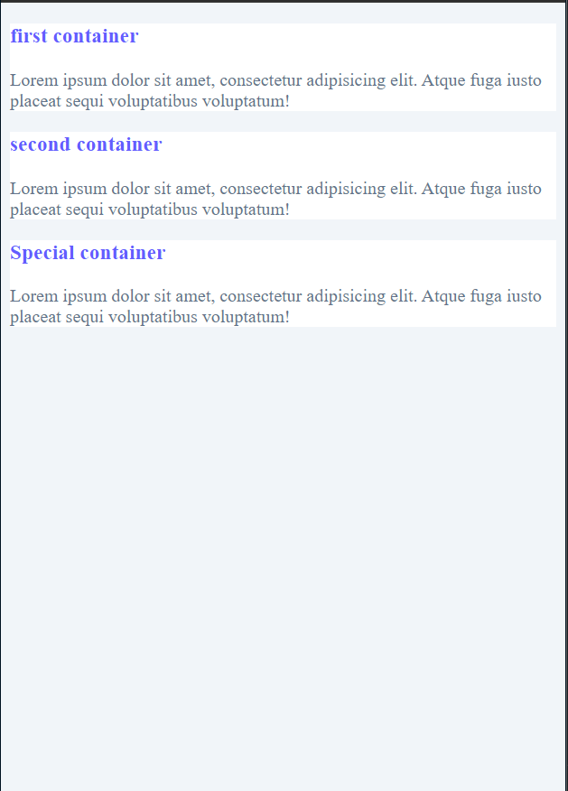

# get external colors form
``https://coolors.co/``

# some color suggestions for projects

```css
body{
    background: #f1f5f9;
}
p{
    color: #64748b;
}

```
result


# Text shadow 
to generate a text shadow use
```plugins
CSS3 Generator chrome extension
```
## some images resources
1. www.pexels.com

# pseudo function :is and :not
to include multi-selector directly
```css
:is(header, nav, selector) h2:hover{
    color: red;
}
```

to exclude one or multi-selector
```css
:not(h1){
    color: white;
}
```

# Default css Variables
```css
:root{
    --primaryColor: #645cff;
    --primary-dark: #3c3799;
    --grey-light: #f1f5f9;
    --grey: #64748b;
    --grey-dark: #0f172a;
    --black: #222;
    --white: #fff;
    --shadow-light: 0 5px 15px rgba(0, 0, 0, 0.1);
    --shadow-dark: 0 5px 15px rgba(0,0,0, .2);
    --fluid-width: 90vw;
    --max-width: 1170px;
    --letter-spacing: 2px;
    --border-raduis: 0.15rem;
    --transition: all 0.3s ease-in-out;
}
```

# Basic CSS project variables 
```css
/*
+++++++++++++
Fonts
+++++++++++++
*/
@import url("https://fonts.googleapis.com/css?family=Catamaran:400,700|Grand+Hotel");

/* objectif
global styles
faster development
reusable
 */

/*
+++++++++++++
Variables
+++++++++++++
*/
:root{
    --clr-primary: #678e3e;
    --clr-primary-light: #beed8c ;
    --clr-grey-1: #102a42;
    --clr-grey-5: #617d98;
    --clr-grey-10: #f1f5f8;
    --clr-white: #fff;
    --ff-primary: "Catamaran", sans-serif;
    --ff-secondary: "Grand Hotel", cursive;
    --transition: all 0.3s linear;
    --spacing: 0.25rem;
    --radius: 0.5rem;
}

*{
    margin: 0;
    padding: 0;
    box-sizing: border-box;
}

body{
    font-family:var(--ff-primary);
    background: var(--clr-white);
    color: var(--clr-grey-1);
    line-height: 1.5;
    font-size: 0.875rem;
}

a{
    text-decoration: none;
}

img{
    width: 100%;
    display: block;
}

h1, h2, h3, h4{
    letter-spacing: var(--spacing);
    text-transform: capitalize;
    line-height: 1.25;
    margin-bottom: 0.75rem;
}

h1{
    font-size: 3rem;
}
h2{
    font-size: 2rem;
}
h3{
    font-size: 1.5rem;
}
h4{
    font-size: .875rem;
}

p{
    margin-bottom: 1.25rem;
}

@media screen and (min-width: 768px) {
    h1{
        font-size: 4rem;
    }
    h2{
        font-size: 2.5rem;
    }
    h3{
        font-size: 2rem;
    }
    h4{
        font-size: 1rem;
    }

    body{
        font-size: 1rem;
    }

    h1, h2, h3, h4{
        line-height: 1;
    }

}
```

# Usable code
1. typical box shadow
```css
selector{
    box-shadow: 0 5px 15px rgba(0,0,0,.1);
}
```
2. over effect box shadow
```css
selector:hover{
    box-shadow: 0 5px 15px rgba(0,0,0,.2);
}
```

# very important for choosing colors for projects
just write color shades on the search engine or
go directly on https://mdigi.tools/color-shades
give the man color and you will see other colors variants easily

generate favicon on https://favicon.io